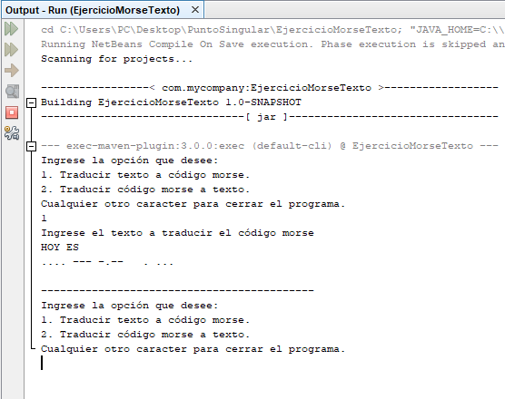
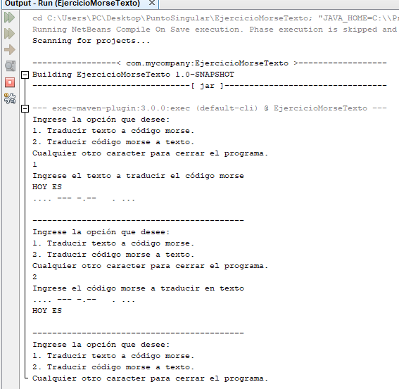
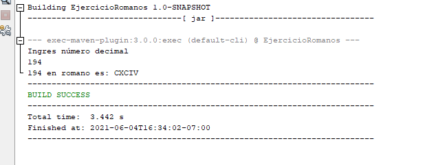
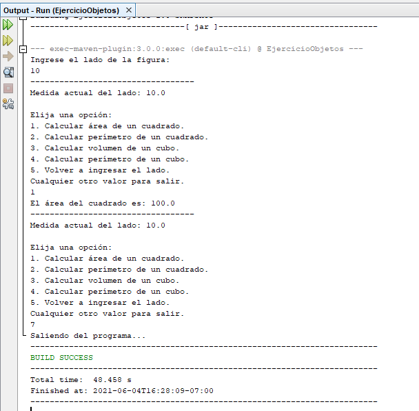

# PruebasPuntoSingular__PeralesAbner
**Nombre completo:** Abner Jesús Perales Niebla  
**Correo:** jesusperalesniebla@gmail.com   
**Número telefónico:** 664 731 5231

---
---
 

## :file_folder: Ejercicio 1  - morse

[Clases en java del proyecto](https://github.com/Abner-Perales/PuntoSingular/tree/main/EjercicioMorseTexto/src/main/java/Morse)

---
---
 

## :file_folder: Ejercicio 2 - romanos

[Clases en java del proyecto](https://github.com/Abner-Perales/PuntoSingular/tree/main/EjercicioRomanos/src/main/java/Romanos)

---
---
 

## :file_folder: Ejercicio 3 - objetos

[Clases en java del proyecto](https://github.com/Abner-Perales/PuntoSingular/tree/main/EjercicioObjetos/src/main/java/Objetos)

---
---
 

